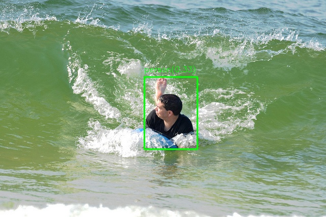
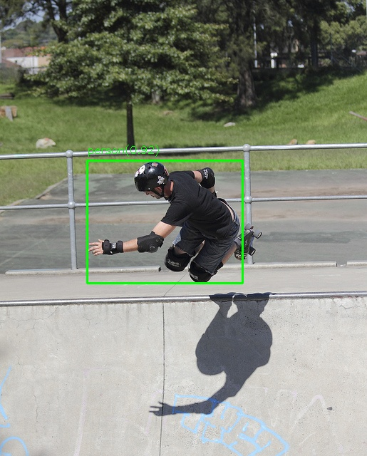
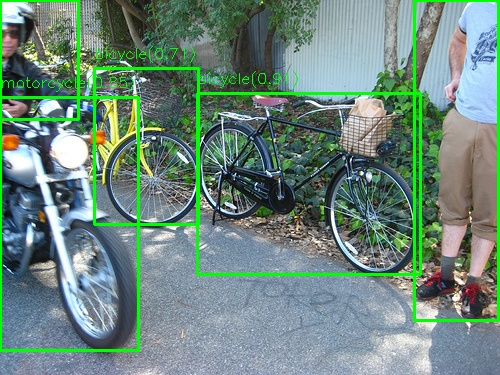
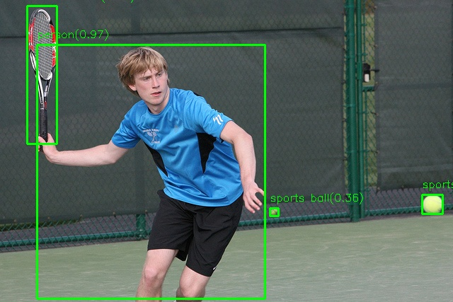

# YOLO26 INT8 批量推理

本模块实现了 YOLO26 模型（YOLOv11-OBB 变体）的 **INT8 量化** 及 **批量推理**，基于 TensorRT 10.11 构建。涵盖从 ONNX 模型 INT8 量化转换到 C++ 批量推理的完整流程。

## 📁 目录结构

```text
yolom_26_int8_batch/
├── CMakeLists.txt                 # CMake 构建配置
├── build.sh                       # 编译脚本
├── test.sh                        # 测试脚本
├── test_yolo26_int8_batch.cpp     # 测试主程序（单图 + 批量）
├── src/
│   ├── yolom26_int8_batch.h       # 推理类头文件
│   └── yolom26_int8_batch.cpp     # 推理类实现
├── trt_base/
│   ├── trt_inference_base.h       # TensorRT 推理基类头文件
│   └── trt_inference_base.cpp     # TensorRT 推理基类实现
├── quant_convert/
│   ├── CMakeLists.txt             # 量化工具构建配置
│   ├── build.sh                   # 量化工具编译脚本
│   ├── onnx2engine_int8.cpp       # ONNX → INT8 Engine 转换工具
│   ├── onnx2engine_int8.sh        # 量化转换脚本
│   └── dataset/                   # 校准数据集（COCO 子集）
└── asset/                         # 测试图片
```

## 🔄 完整流程

### 第一步：INT8 量化转换

INT8 量化需要校准数据来统计各层张量的数值范围，从而计算量化参数（scale 和 zero-point）。

```bash
cd quant_convert
bash build.sh          # 编译量化转换工具
bash onnx2engine_int8.sh  # 执行 INT8 量化转换
```

**量化转换的核心参数：**

| 参数 | 说明 |
|------|------|
| ONNX 模型 | `yolo26m.onnx`，YOLO26 的 ONNX 导出文件 |
| Engine 输出 | `yolom_int8_batch_4.engine`，序列化的 INT8 引擎 |
| 校准数据目录 | `./dataset/`，包含用于校准的 COCO 子集图片 |
| Batch Size | `4`，引擎支持的最大批量大小 |
| 校准表 | `calib.table`，缓存校准结果（二次构建可复用） |

**量化过程中的关键处理（`onnx2engine_int8.cpp`）：**

1. **SiLU 激活函数替换**：ONNX 中的 SiLU（Sigmoid × Mul）在 INT8 下无法直接校准，需在构建时通过 `setFlag(BuilderFlag::kREJECT_EMPTY_ALGORITHMS)` 避免回退失败
2. **FP16 回退兜底**：设置 `setFlag(BuilderFlag::kFP16)`，对于无法 INT8 量化的层自动回退到 FP16
3. **IInt8EntropyCalibrator2**：使用熵校准算法，统计激活值分布并选择最优量化阈值

### 第二步：编译推理程序

```bash
cd yolom_26_int8_batch
bash build.sh
```

输出可执行文件：`./build/test_yolo26_int8_batch`

### 第三步：运行测试

```bash
# 单图测试
./build/test_yolo26_int8_batch ./quant_convert/yolom_int8_batch_4.engine ./asset/000000002261.jpg

# 批量测试（最多 4 张图片）
./build/test_yolo26_int8_batch ./quant_convert/yolom_int8_batch_4.engine \
    ./asset/000000002261.jpg \
    ./asset/000000018519.jpg \
    ./asset/000000011149.jpg \
    ./asset/000000085772.jpg
```

## 🏗️ 核心设计

### 推理类 `YOLOM26Int8Batch`

继承自 `TrtInferenceBase` 基类，主要接口：

```cpp
// 单图推理
bool infer_single(const cv::Mat& image, ImageDetections& result, float conf_threshold = 0.5f);

// 批量推理
bool infer_batch(const std::vector<cv::Mat>& images, std::vector<ImageDetections>& results, float conf_threshold = 0.5f);
```

**检测结果格式：** `Detection = [class_id, confidence, x1, y1, x2, y2]`

### 预处理流程

```
原始图像 → Letterbox(640×640) → 归一化(1/255) → HWC→CHW → GPU
```

- **Letterbox**：保持宽高比缩放，灰色填充（114, 114, 114），记录缩放因子和偏移量用于坐标还原

### 后处理流程

```
引擎输出 [300, 6] → 置信度过滤 → 坐标反变换 → 退化框过滤 → NMS → 最终结果
```

- **NMS（非极大值抑制）**：IoU 阈值 0.45，按类别独立抑制，解决 INT8 量化噪声导致的重复检测问题
- **退化框过滤**：跳过宽或高小于 1 像素的无效框

### 批量推理策略

由于 YOLO26 的 one-to-one 检测头（`model.23`）内部包含 `TopK`/`GatherElements` 等动态操作，在 batch > 1 时无法正确分配各图像的检测结果。因此采用**逐图顺序推理**策略：每张图单独调用引擎，确保输出正确。

## 📊 测试结果

测试环境：NVIDIA GPU，TensorRT 10.11，INT8 精度，Batch=4

```
=== YOLO26 INT8 Batch Inference Test ===
Engine: ./quant_convert/yolom_int8_batch_4.engine
Batch size: 4

--- Single Image Inference ---
Single inference: 27.77 ms, 1 detections

--- Batch Inference (4 images) ---
Batch inference: 29.66 ms total, 7.42 ms per image
Image 0: 1 detections
Image 1: 1 detections
Image 2: 5 detections
Image 3: 4 detections
```

**推理速度对比：**

| 模式 | 耗时 | 每图耗时 |
|------|------|----------|
| 单图推理 | 27.77 ms | 27.77 ms |
| 批量推理（4图） | 29.66 ms | **7.42 ms** |

批量推理相比单图推理有 **3.7 倍** 的吞吐提升。

**检测结果示例：**

| 图片 | 检测数量 | 结果 |
|------|----------|------|
| Image 0 (640×427) | 1 |  |
| Image 1 (515×640) | 1 |  |
| Image 2 (500×375) | 5 |  |
| Image 3 (640×427) | 4 |  |

## ⚠️ 注意事项

1. **校准数据**：INT8 量化的精度高度依赖校准数据的代表性，建议使用 500~1000 张与实际场景相近的图片
2. **校准缓存**：`calib.table` 会缓存校准结果，修改模型或校准数据后需删除重建
3. **Batch Size**：Engine 的 batch size 在构建时固定，推理时不能超过该值
4. **精度损失**：INT8 量化会带来一定的精度损失，对于小目标检测影响较大，可通过增加校准数据或使用 QAT（量化感知训练）缓解