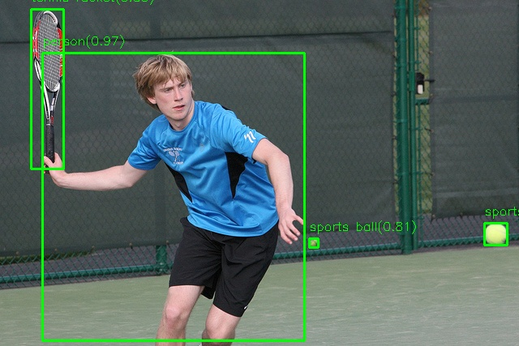

# 基于 TensorRT 的 YOLOv8m 目标检测推理

本项目实现了基于 TensorRT 加速的 YOLOv8m 目标检测推理，包含完整的模型转换、推理基类封装和端到端部署流程。

## 📋 目录结构

```
├── onnx2tensorrt           # ONNX 转 TensorRT Engine 工具
├── tensorrt_inference_base # TensorRT 推理基类封装
├── yolo26_src             # YOLOv8m 推理实现代码
├── model_convert          # 模型转换脚本
├── asset                  # 测试图片与结果
└── build.sh               # 编译脚本
```

## 🚀 快速开始

### Step 1: 模型转换（ONNX → TensorRT Engine）

使用 `onnx2tensorrt` 工具将 ONNX 模型转换为 TensorRT 引擎文件：

```bash
cd model_convert
bash convert.sh
```

执行完成后将生成 `yolo26m.engine` 文件。

### Step 2: 推理代码开发

- **推理基类**：参见 `tensorrt_inference_base` 目录，已封装 TensorRT 的加载、内存管理、推理执行等通用流程
- **YOLOv8m 实现**：参见 `yolo26_src` 目录，继承基类实现具体的预处理、推理和后处理逻辑
- **编译配置**：已配置 `CMakeLists.txt`，支持一键编译

### Step 3: 编译与运行

执行编译脚本并运行推理：

```bash
# 编译项目
bash build.sh

# 运行推理
./build/test_yolo26_trt ./model_convert/yolo26m.engine ./asset/000000085772.jpg
```

## 📊 推理效果对比

<table>
  <tr>
    <th align="center">原始图片</th>
    <th align="center">检测结果</th>
  </tr>
  <tr>
    <td align="center"></td>
    <td align="center"></td>
  </tr>
</table>